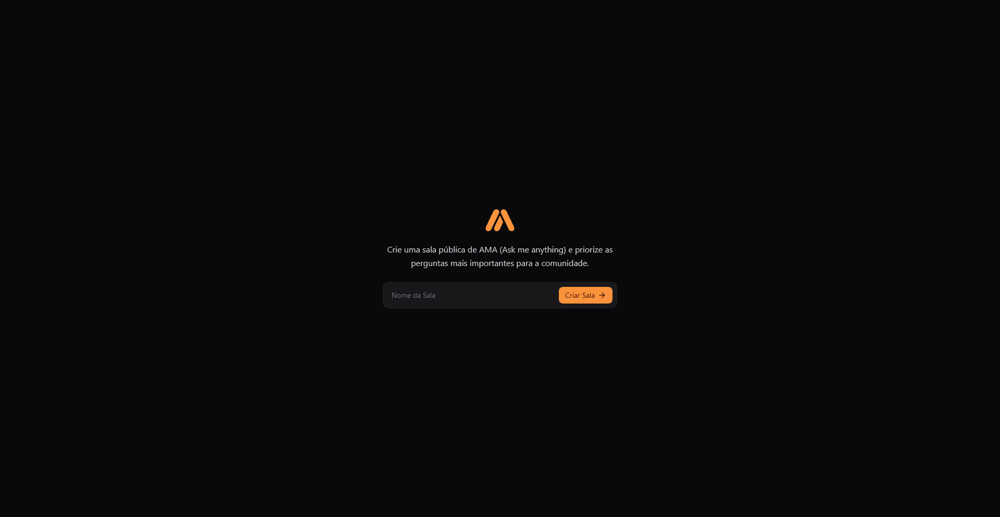
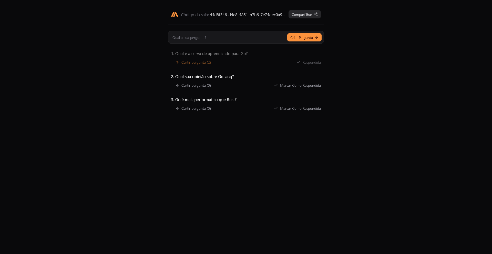

# AMA Room (Ask Me Anything)

#

#

### Technologies used:
- **Backend**
  - Docker
  - PostgreSQL
  - Go
- **Frontend**
  - React 19 RC
  - React Router DOM
  - React-Query
  - Tailwind CSS
#

### Notes:
This was my introduction to the Go Lang and to the Backend itself. I look forward into add more features into this application, including a real-time answers, and room creator authentication for answers. If you wish to contribute with more features, feel free to add them. 

_This project was part of the Rocketseat Event Go + React Week_